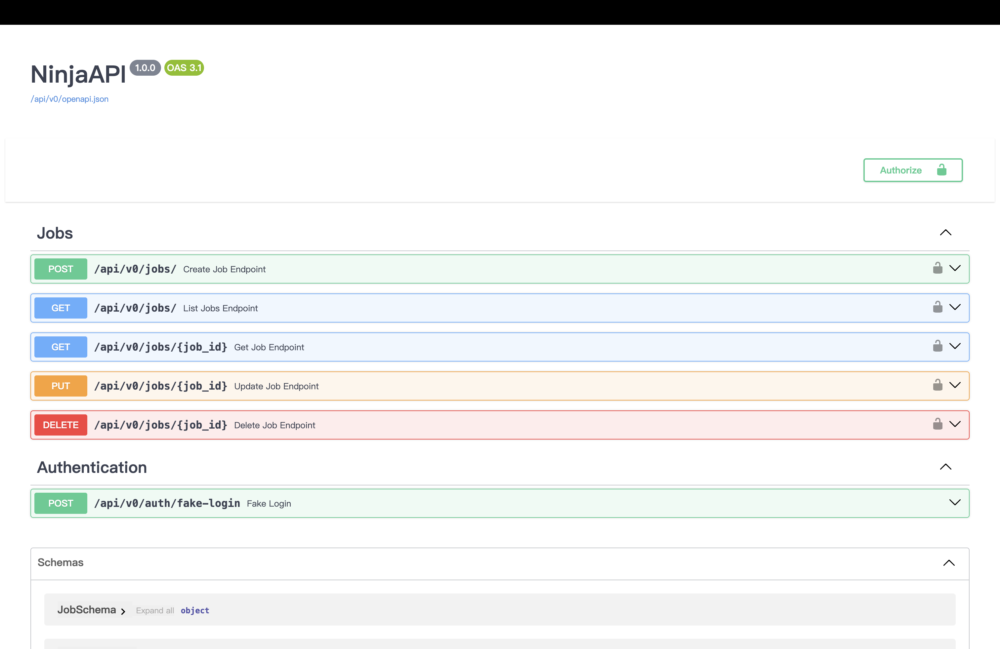
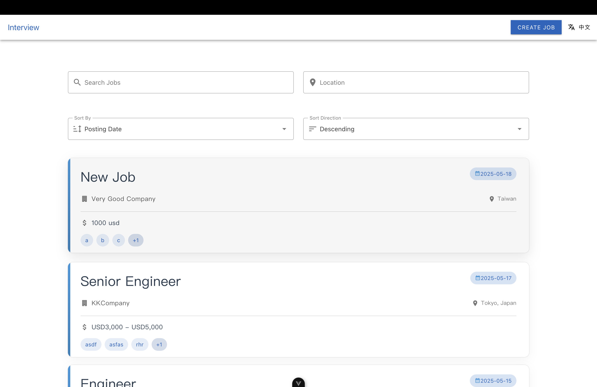

# TalentLabs Interview Project

Please setup backend part first, then setup frontend part




## Backend

### Prerequisites
- Docker
- Python 3.12 or higher
- uv (for package management)

### Setup Instructions

1. **Navigate to the backend directory**:
   ```bash
   cd ./backend
   ```

2. **Install dependencies**:
   ```bash
   uv install
   ```

3. **Run the database using Docker**:
   Ensure Docker is running on your machine, then execute:
   ```bash
   docker-compose up -d
   ```

4. **Apply database migrations**:
   ```bash
   uv run python manage.py migrate
   ```

5. **Insert fake jobs into the database**:
   ```bash
   uv run python insert_fake_jobs.py
   ```

6. **Run the development server**:
   ```bash
   uv run python manage.py runserver
   ```

### Additional Information

- The backend is built using Django and Django Ninja for API development.
- The database used is PostgreSQL, configured via Docker.
- For testing, `pytest` and `pytest-django` are used.

## Frontend

### Prerequisites
- Node.js (version 22 or higher)
- pnpm (for package management)

### Setup Instructions

1. **Navigate to the frontend directory**:
   ```bash
   cd ./frontend
   ```

2. **Install dependencies**:
   ```bash
   pnpm install
   ```

3. **Run the development server**:
   ```bash
   pnpm run dev
   ```

4. **Build for production**:
   ```bash
   pnpm run build
   ```

5. **Preview the production build**:
   ```bash
   pnpm run preview
   ```

### Additional Information

- The frontend is built using Vue 3 and Vite for development and build processes.
- Vuetify is used as the UI framework.
- The project includes ESLint and Prettier for code linting and formatting.
- TypeScript is used for type checking.

